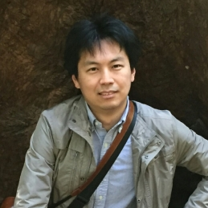

### JaeJin Choi  
  

Postdoc in University of California, Berkeley, since 2024, focused on:  

- Evolutionary study
- Development and application of an alignment-free sequence comparison of information theory
- Virus evolution and origin study

My interest in biology and computer science lead me into the field of bioinformatics/computational biology. Currently focus on development and application of a sequence comparison based on language analysis (e.g., alignment-free approach) that view biological sequences as information and rely on a choice of descriptors (data) over models.  

### Contact  
* jaejinchoi@berkeley.edu (work), jaejinchoi@outlook.com (personal)  
* [https://orcid.org/0000-0002-2860-9606](https://orcid.org/0000-0002-2860-9606)  

### General field of study  
* Bioinformatics
* Computational Biology

### Current research interest  
* Evolutionary study; Phylodynamics
* Population genomics
* Data science
* (Large) Data summary and visualization 

### Publication/Collaboration  
| Title | Date |
|--------------|------------:|
| B.-J. Kim, JJ. Choi, S.-H. Kim, On whole-genome demography of world’s ethnic groups and individual genomic identity. Sci Rep 13, 6316. doi:10.1038/s41598-023-32325-w | 2023-04 |
| Pre-print: Whole-Proteome Tree of Arthropods: An “alignment-free” phylogeny of proteome “books”| 2020-02 | 2020-07 |
| Choi JJ, Kim S-H. Whole-proteome tree of life suggests a deep burst of organism diversity. Proc Natl Acad Sci. 2019;117:756155. doi:10.1101/756155.| 2020-02 |
| Zielezinski A, Girgis HZ, Bernard G, Leimeister C-A, Tang K, Dencker T, et al. Benchmarking of alignment-free sequence comparison methods. Genome Biol. 2019;20:144. doi:10.1186/s13059-019-1755-7. | 2019 |
| Choi JJ, Kim S-H. A genome Tree of Life for the Fungi kingdom. Proc Natl Acad Sci. 2017;114:201711939. doi:10.1073/pnas.1711939114 | 2017-08 |

### Work experience
| Institute | Position | Anticipation |Location | Date |
|--------------|-------------|-------------|-------------|-------------|
| University of California, Berkeley. Dept. Chemistry | Assistant specialist | Alignment-free method development in an application to evolutionary study (phylogeny) | Berkeley, California, USA | 2014-10 to 2019-04 |
| Korean Bioinformation Center | Inter-researcher | Fungi phylogeny; Pan Asian Population Genome Initiative (PAPGI); population migration and admixture study | Daejeon, Republic of Korea | 2013-09 to 2014-08 |

### Education
| Institute | Program/Department | Status | Location | Date |
|--------------|-------------|-------------|-------------|-------------|
| University of California Berkeley | Comparative Biochemistry graduate program | PhD in Comparative Biochemistry, and Designated Emphasis in Computational and Genomic Biology | Berkeley, California, USA | 2019-08 to 2024-08 |
|Yonsei University| Integrated OMICS for Biomedical Sciences | MS in Biomedical science | Seoul, Republic of Korea | 2011-03 to 2013-08 |
| Soongsil University | School of Systems Biomedical Science | BS in Life Science and Bioinformatics | Seoul, Republic of Korea | 2005-03 to 2011-02 |
